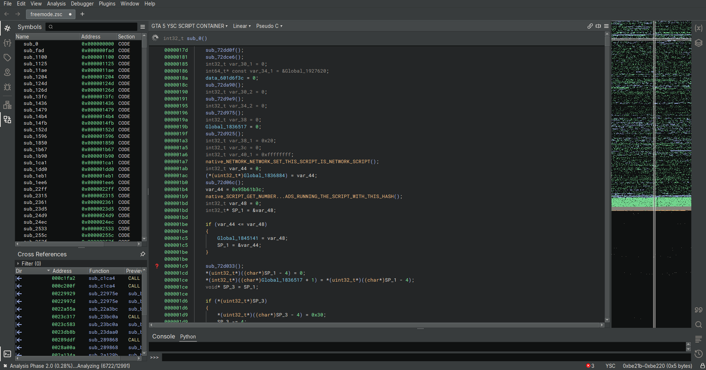
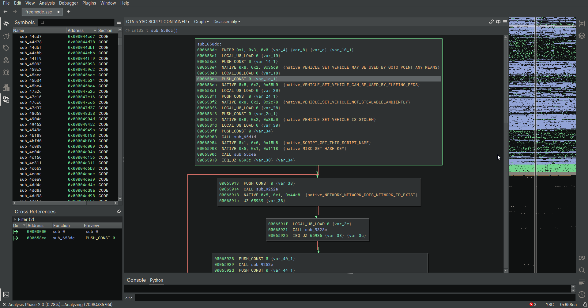

# Binary Ninja YSC Architecture/Lifter

#### Summary
This project is an architecture plugin for Binary Ninja, allowing you to disassemble and even decompile YSC format scripts from the game *Grand Theft Auto V*. The lifting to BNIL is not perfect due to complex instructions being hard to translate, so psuedocode is not perfect but does get the idea across. Work still has to be done to make each instruction semantically correct.

#### How to build/install
This project requires the Binary Ninja SDK to build. To install, please build with cmake and set your Binary Ninja install folder in binja.cmake.
You can also load in a natives.json file from [alloc8or's repo](https://raw.githubusercontent.com/alloc8or/gta5-nativedb-data/refs/heads/master/natives.json) by placing it in the plugin folder along with the rest of the files.

#### Profiling
Set `YSC_BINJA_TRACE=/tmp/ysc-binja-trace.json` before starting Binary Ninja to write a Chrome/Perfetto-compatible minitrace JSON file. Open it in `chrome://tracing` or https://ui.perfetto.dev.

Large scripts skip eager static symbol creation above `YSC_BINJA_STATIC_SYMBOL_LIMIT` entries, defaulting to `4096`; referenced statics are still named on demand. Large scripts also limit recursive call-target analysis above `YSC_BINJA_FUNCTION_ANALYSIS_LIMIT` functions, defaulting to `2048`, and disable executable CODE scanning for scripts over 1 MiB; set `YSC_BINJA_ENABLE_LARGE_SCRIPT_CALL_ANALYSIS=1` to force full call fanout or `YSC_BINJA_ENABLE_LARGE_SCRIPT_CODE_SCAN=1` to restore executable-region scanning. Set `YSC_BINJA_ENABLE_INLINED_CALL_CHECKS=1` to include optional native/indirect call inline checks in analysis. Set `YSC_BINJA_TRACE_CALL_CHECKS=1` only when you need per-call `CheckForInlinedCall` spans, since large scripts can emit hundreds of thousands of them.

#### Screenshots

